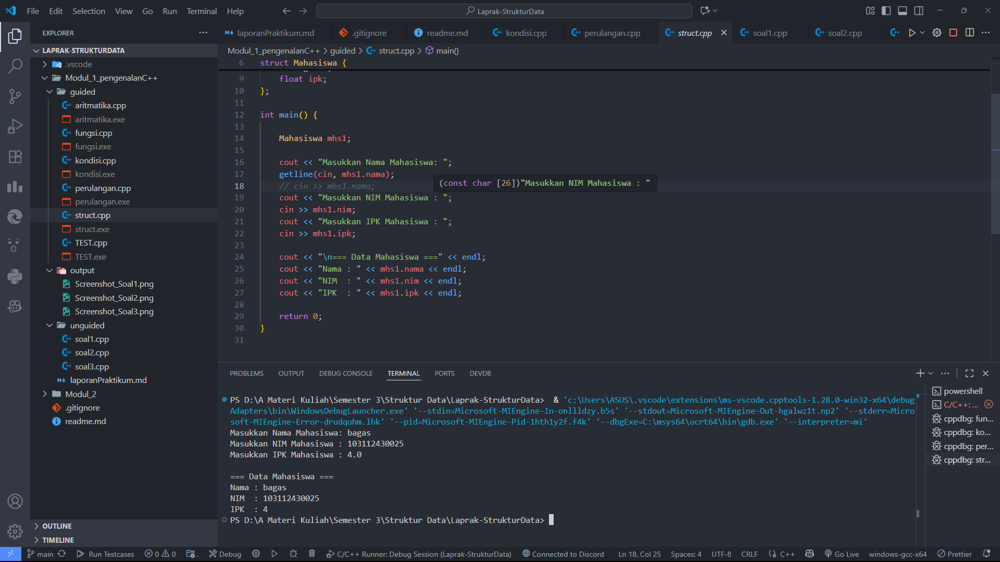

# <h1 align="center">Laporan Praktikum Modul 1 <br> Pengenalan C++</h1>

<p align="center">Bagas Alfanto - 103112430025</p>

## Dasar Teori

Pemrograman merupakan proses penyusunan instruksi yang logis dan sistematis agar komputer dapat menjalankan suatu tugas. Dalam C++, pemrograman dasar meliputi penggunaan variabel, tipe data, operasi aritmatika, struktur kontrol, fungsi, serta tipe data bentukan seperti struct. Variabel digunakan untuk menyimpan data sementara sesuai dengan tipe datanya, misalnya int untuk bilangan bulat, float atau double untuk bilangan desimal, dan string untuk teks. Operasi aritmatika dasar (penjumlahan, pengurangan, perkalian, pembagian) dapat dilakukan menggunakan operator bawaan C++.

Struktur kontrol merupakan elemen penting dalam pemrograman karena menentukan alur jalannya program. Percabangan seperti if-else dan switch-case digunakan untuk membuat keputusan berdasarkan kondisi tertentu. Perulangan seperti for, while, dan do-while digunakan untuk menjalankan suatu perintah secara berulang. Selain itu, fungsi dan prosedur membantu memecah program menjadi bagian-bagian kecil sehingga kode lebih terstruktur, mudah dipahami, dan dapat digunakan kembali.

C++ juga menyediakan struct untuk mengelompokkan beberapa variabel dengan tipe data berbeda menjadi satu kesatuan. Hal ini mempermudah pengelolaan data yang saling berhubungan, contohnya data mahasiswa yang terdiri dari nama, NIM, dan IPK. Untuk interaksi dengan pengguna, C++ menyediakan cin untuk input dan cout untuk output, sedangkan fungsi tambahan seperti getline atau getchar bisa digunakan untuk membaca string maupun karakter tunggal.

Dengan memahami konsep dasar ini, mahasiswa dapat membangun program sederhana seperti kalkulator aritmatika, pengubah angka menjadi teks, penentu hari kerja/libur, hingga pencetak pola angka. Latihan-latihan ini melatih logika, keterampilan berpikir komputasional, serta pemahaman mengenai struktur dasar dalam pemrograman.

## Guided

### Soal 1 Aritmatika

```cpp
#include <iostream>
using namespace std;
int main()
{
    int W, X, Y;
    float Z;
    X = 7;
    Y = 3;
    W = 1;
    Z = (X + Y) / (Y + W);
    cout << "Nilai z = " << Z << endl;
    return 0;
}
```

> 

Program ini menghitung nilai `Z` dari rumus ((X + Y) / (Y + W)) dengan nilai tetap (X = 7), (Y = 3), dan (W = 1). Hasil perhitungan disimpan dalam variabel `Z` bertipe `float`, kemudian ditampilkan outputnya.

### Soal 2 Fungsi

```cpp
#include <iostream>
using namespace std;

// Prosedur: hanya menampilkan hasil, tidak mengembalikan nilai
void tampilkanHasil(double p, double l)
{
    cout << "\n=== Hasil Perhitungan ===" << endl;
    cout << "Panjang : " << p << endl;
    cout << "Lebar   : " << l << endl;
    cout << "Luas    : " << p * l << endl;
    cout << "Keliling: " << 2 * (p + l) << endl;
}

// Fungsi: mengembalikan nilai luas
double hitungLuas(double p, double l)
{
    return p * l;
}

// Fungsi: mengembalikan nilai keliling
double hitungKeliling(double p, double l)
{
    return 2 * (p + l);
}

int main()
{
    double panjang, lebar;

    cout << "Masukkan panjang: ";
    cin >> panjang;
    cout << "Masukkan lebar  : ";
    cin >> lebar;

    // Panggil fungsi
    double luas = hitungLuas(panjang, lebar);
    double keliling = hitungKeliling(panjang, lebar);

    cout << "\nDihitung dengan fungsi:" << endl;
    cout << "Luas      = " << luas << endl;
    cout << "Keliling  = " << keliling << endl;

    // Panggil prosedur
    tampilkanHasil(panjang, lebar);

    return 0;
}

```

> 

Program ini digunakan untuk menghitung luas dan keliling persegi panjang dengan input panjang dan lebar dari pengguna. Perhitungan dilakukan menggunakan dua fungsi (hitungLuas dan hitungKeliling) yang mengembalikan nilai, serta satu prosedur (tampilkanHasil) yang langsung menampilkan hasil perhitungan.

### Soal 3 Perkondisian

```cpp
#include <iostream>
using namespace std;
// int main()
// {
//     double tot_pembelian, diskon;
//     cout << "total pembelian: Rp";
//     cin >> tot_pembelian;
//     diskon = 0;
//     if (tot_pembelian >= 100000)
//         diskon = 0.05 * tot_pembelian;
//     cout << "besar diskon = Rp" << diskon;
// }

// int main()
// {
//     double tot_pembelian, diskon;
//     cout << "total pembelian: Rp";
//     cin >> tot_pembelian;
//     diskon = 0;
//     if (tot_pembelian >= 100000)
//         diskon = 0.05 * tot_pembelian;
//     else
//         diskon = 0;
//     cout << "besar diskon = Rp" << diskon;
// }

int main()
{
    int kode_hari;
    cout << "Menentukan hari kerja/libur\n"<<endl;
    cout << "1=Senin 3=Rabu 5=Jumat 7=Minggu "<<endl;
    cout << "2=Selasa 4=Kamis 6=Sabtu "<<endl;
    cin >> kode_hari;
    switch (kode_hari)
    {
    case 1:
        cout<<"Hari Kerja";
        break;
    case 2:
        cout<<"Hari Kerja";
        break;
    case 3:
        cout<<"Hari Kerja";
        break;
    case 4:
        cout<<"Hari Kerja";
        break;
    case 5:
        cout<<"Hari Kerja";
        break;
    case 6:
        cout<<"Hari Libur";
        break;
    case 7:
        cout<<"Hari Libur";
        break;
    default:
        cout<<"Kode masukan salah!!!";
    }
    return 0;
}

```

> 

Program ini terdiri dari beberapa bagian contoh kode. Dua bagian pertama (dalam komentar) menunjukkan cara menghitung diskon 5% jika total pembelian lebih dari atau sama dengan Rp100.000. Bagian terakhir adalah program aktif yang meminta input kode hari (1–7), lalu menggunakan `switch` untuk menentukan apakah hari tersebut termasuk **hari kerja** atau **hari libur**. Jika input tidak sesuai, program akan menampilkan pesan kesalahan.

### Soal 4 Perulangan

```cpp
#include <iostream>
using namespace std;
// int main()
// {
//     int jum;
//     cout << "jumlah perulangan: ";
//     cin >> jum;
//     for (int i = 0; i < jum; i++)
//     {
//         cout << "saya sahroni\n";
//     }
//     return 1;
// }

// while
int main()
{
    int i = 1;
    int jum;
    cin >> jum;
    do
    {
        cout << "bahlil ke-" << (i + 1) << endl;
        i++;
    } while (i < jum);
    return 0;
}
```

> 

Program ini berisi contoh penggunaan perulangan. Bagian pertama (yang dikomentari) menggunakan for loop untuk mencetak tulisan berulang sesuai jumlah yang dimasukkan. Bagian kedua (aktif) menggunakan do while loop, di mana program akan mencetak teks "bahlil ke-" diikuti nomor urutan mulai dari 2, terus berulang sampai mencapai jumlah yang ditentukan oleh pengguna.

### Soal 5 Struct

```cpp
#include <iostream>
#include <string>
using namespace std;

// Definisi struct
struct Mahasiswa {
    string nama;
    string nim;
    float ipk;
};

int main() {

    Mahasiswa mhs1;

    cout << "Masukkan Nama Mahasiswa: ";
    getline(cin, mhs1.nama);
    // cin >> mhs1.nama;
    cout << "Masukkan NIM Mahasiswa : ";
    cin >> mhs1.nim;
    cout << "Masukkan IPK Mahasiswa : ";
    cin >> mhs1.ipk;

    cout << "\n=== Data Mahasiswa ===" << endl;
    cout << "Nama : " << mhs1.nama << endl;
    cout << "NIM  : " << mhs1.nim << endl;
    cout << "IPK  : " << mhs1.ipk << endl;

    return 0;
}

```

> 

Program ini menggunakan struct bernama Mahasiswa untuk menyimpan data berupa nama, NIM, dan IPK. Pengguna diminta mengisi data mahasiswa melalui input, kemudian program menampilkan kembali data tersebut dalam format yang rapi di layar.

### Soal 6 Test

```cpp
#include <iostream>
using namespace std;
int main()
{
    string ch;
    cout << "Masukkan sebuah karakter: ";
    // cin >> ch;
    ch = getchar();  //Menggunakan getchar() untuk membaca satu karakter
    cout << "Karakter yang Anda masukkan adalah: " << ch << endl;
    return 0;
}

```

> 

Program ini meminta pengguna memasukkan sebuah kata, lalu membacanya menggunakan fungsi **`getchar()`**. Setelah itu, program menampilkan kembali karakter yang dimasukkan tersebut.

## Unguided

### Soal 1

Buatlah program yang menerima input-an dua buah bilangan bertipe float, kemudian memberikan output-an hasil penjumlahan, pengurangan, perkalian, dan pembagian dari dua bilangan tersebut.

```cpp
#include <iostream>
using namespace std;

int main(){
    float n1, n2;

    cout << "Masukkan nilai pertama: ";
    cin >> n1;
    cout << "Masukkan nilai kedua: ";
    cin >> n2;

    // Penjumlahan
    cout << "Hasil penjumlahan: " << n1 + n2 << endl;
    // Pengurangan
    cout << "Hasil pengurangan: " << n1 - n2 << endl;
    // Perkalian
    cout << "Hasil perkalian: " << n1 * n2 << endl;
    // Pembagian
    if(n2 != 0){
        cout << "Hasil pembagian: " << n1 / n2 << endl;
    } else {
        cout << "Pembagian tidak boleh dengan 0" << endl;
    }
    return 0;
}

```

> Output
> 

Kode C++ di atas adalah program sederhana untuk menghitung operasi aritmatika dasar antara dua bilangan (n1 dan n2) yang dimasukkan user. Program menampilkan hasil penjumlahan, pengurangan, perkalian, dan pembagian (dengan pengecekan agar tidak membagi dengan nol).

### Soal 2

Buatlah sebuah program yang menerima masukan angka dan mengeluarkan angak tersebut dalam bentuk tulisan. Angka yang diinput user adalah positif mulai dari 0 s.d 100

```cpp
#include <iostream>
using namespace std;

int main() {
    int n;

    cout << "Masukkan angka (1-100): ";
    cin >> n;

    string angka[10] = {
        "satu", "dua", "tiga", "empat", "lima",
        "enam", "tujuh", "delapan", "sembilan", "sepuluh"
    };

    if (n == 100) {
        cout << "seratus" << endl;
    } else if (n >= 1 && n <= 10) {
        cout << angka[n - 1] << endl;
    } else if (n > 10 && n < 20) {
        cout << angka[n - 11] + " belas" << endl;
    } else if (n >= 20 && n < 100) {
        int puluh = n / 10;
        int satuan = n % 10;
        string result = angka[puluh - 1] + " puluh";
        if (satuan != 0) {
            result += " " + angka[satuan - 1];
        }
        cout << result << endl;
    } else {
        cout << "Angka di luar jangkauan" << endl;
    }

    return 0;
}

```

> Output
> 

Program di atas merupakan program C++ yang berfungsi untuk mengubah angka yang dimasukkan pengguna dalam rentang 1 hingga 100 menjadi bentuk tulisan dalam bahasa Indonesia. Program menggunakan array untuk menyimpan kata bilangan dari satu sampai sepuluh. Apabila pengguna memasukkan angka 100, program akan langsung menampilkan kata “seratus”. Jika angka yang dimasukkan berada pada rentang 1 sampai 10, program akan mengambil kata yang sesuai dari array. Untuk angka antara 11 hingga 19, program akan menambahkan kata “belas” setelah kata satuan (misalnya 12 → “dua belas”). Sementara itu, untuk angka 20 hingga 99, program akan memecah angka menjadi puluhan dan satuan, lalu menampilkannya dalam format “x puluh y” (misalnya 42 → “empat puluh dua”). Jika input berada di luar jangkauan 1–100, maka program akan menampilkan pesan “Angka di luar jangkauan”.

### Soal 3

Buatlah program yang dapat memberikan input dan output seperti segitiga dengan angka

```cpp
#include <iostream>
using namespace std;

int main() {
    int n;

    cout << "Masukan angka: ";
    cin >> n;

    for (int i = n; i >= 1; i--) {
        for (int j = 1; j <= n - i; j++) {
            cout << "  ";
        }
        for (int j = i; j >= 1; j--) {
            cout << j << " ";
        }

        cout << "* ";

        for (int j = 1; j <= i; j++) {
            cout << j;
            if (j != i) cout << " ";
        }
        cout << endl;
    }

    for (int i = 0; i < n; i++) {
        cout << "  ";
    }
    cout << "*" << endl;

    return 0;
}

```

> Output
> 

Program ini berfungsi untuk mencetak pola angka simetris dengan tanda bintang (_) di tengahnya. Pola dibentuk berdasarkan input angka n, di mana setiap baris menampilkan angka menurun di sebelah kiri, tanda bintang di tengah, dan angka menaik di sebelah kanan. Setelah semua baris tercetak, program menambahkan satu baris terakhir yang hanya berisi tanda _.

## Referensi

1. Wijayanto, B. A., & Anistyasari, Y. (2022). E-Modul Pembelajaran Coding Berbasis Pengenalan Budaya Indonesia untuk Meningkatkan Computational Thinking. Jurnal Obsesi: Jurnal Pendidikan Anak Usia Dini, 6(4), 2866–2874. https://obsesi.or.id/index.php/obsesi/article/view/2323

2. Safitri, I. (2022). Pembelajaran Coding di Sekolah Dasar. Jurnal Pendidikan Indonesia (JPI), 3(3), 201–210. https://jpion.org/index.php/jpi/article/view/326

3. Prabowo, A., & Setiawan, A. (2019). Learning Tool for Robotics Basic Programming Based on Contextual Teaching and Learning to Improve Problem-Solving Skills. Jurnal Pendidikan Teknologi dan Kejuruan, 25(2), 159–167. https://jurnal.uny.ac.id/index.php/jptk/article/view/22856
