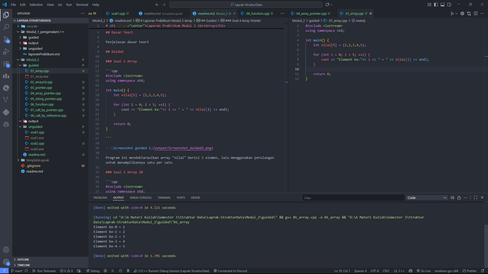
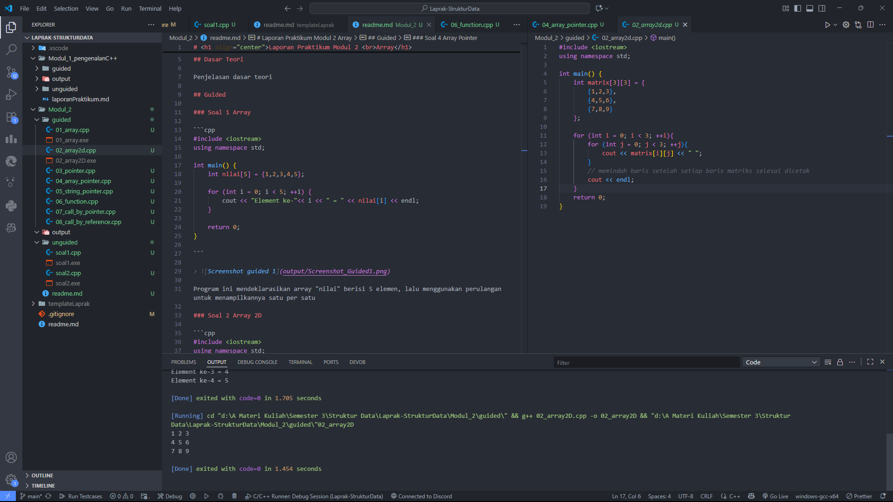
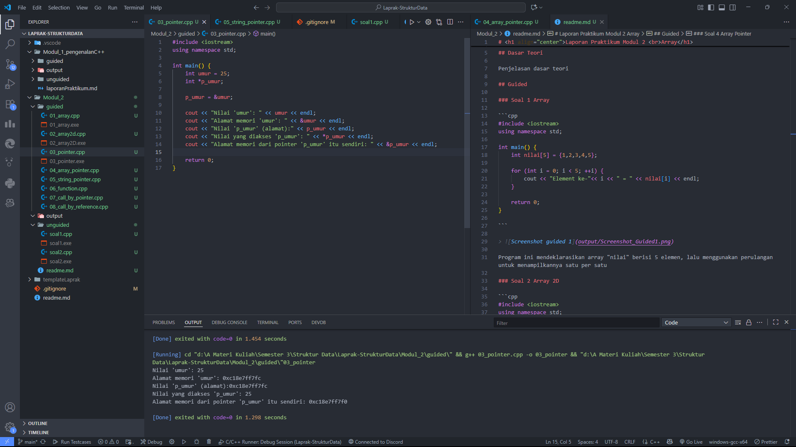
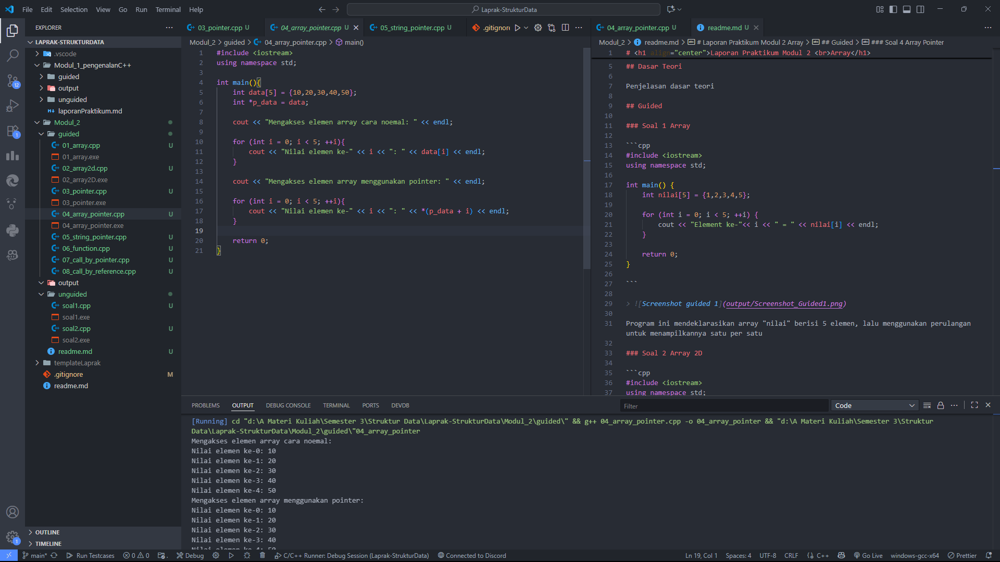
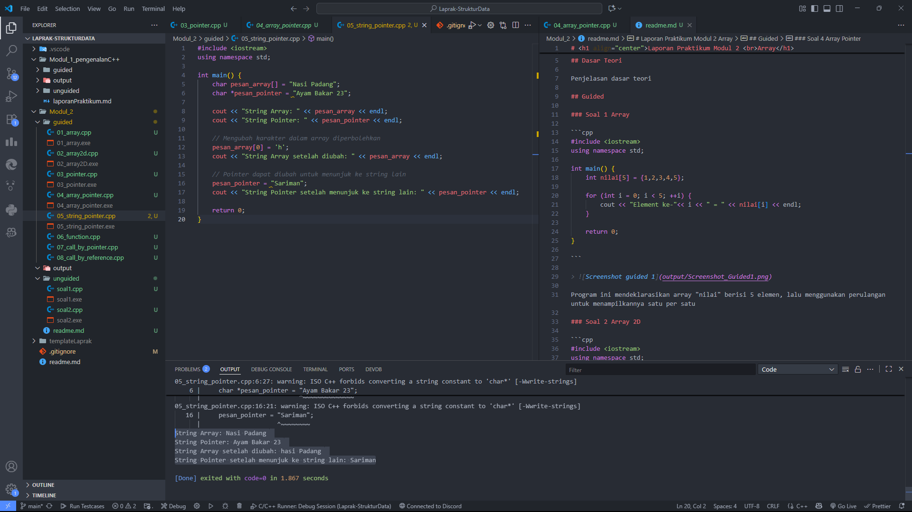
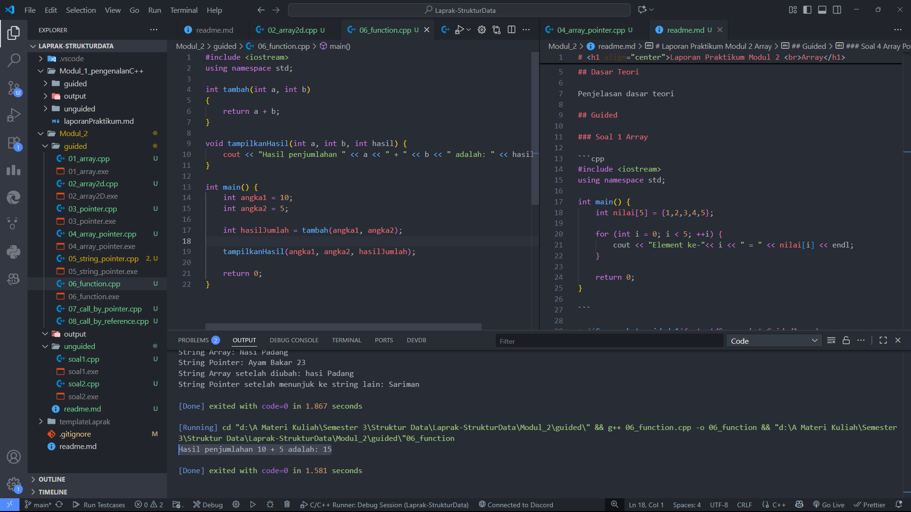
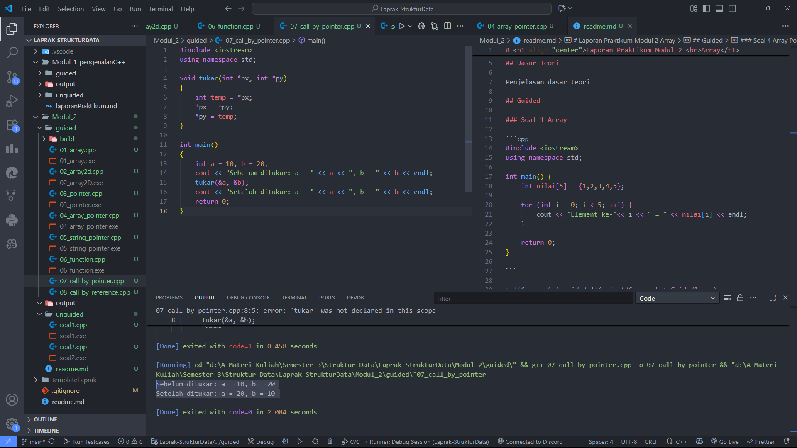
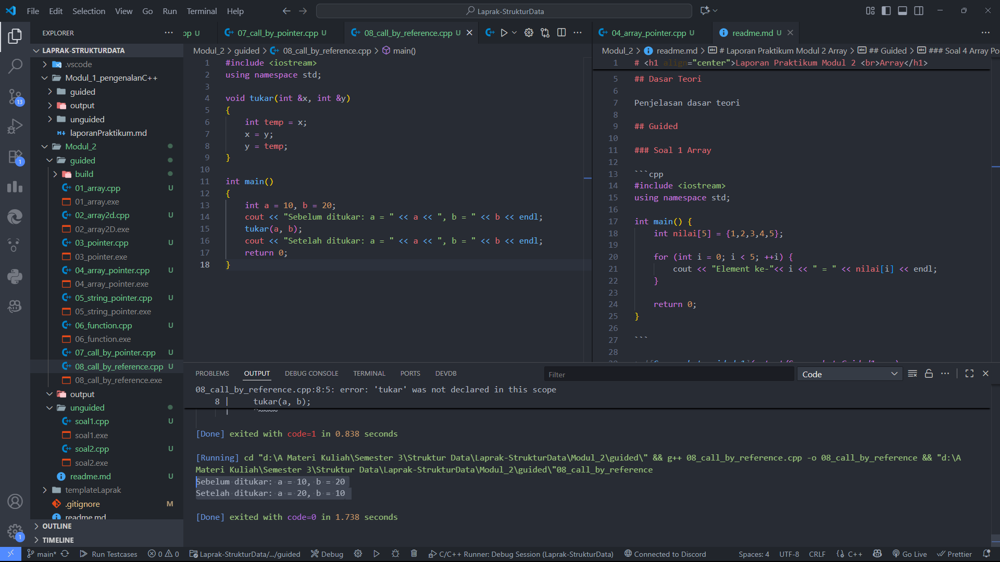
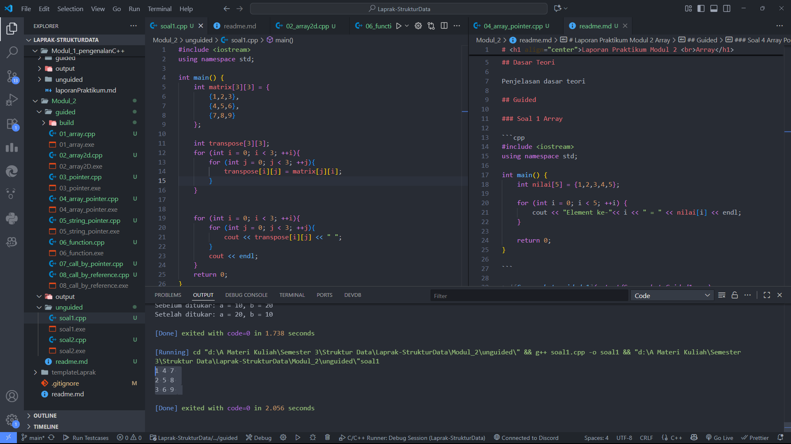
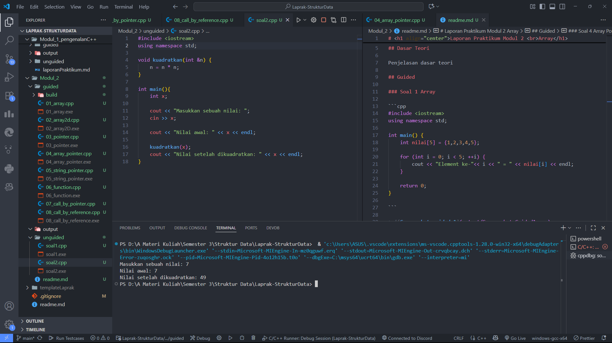

# <h1 align="center">Laporan Praktikum Modul 2 <br>Array</h1>

<p align="center">Bagas Alfanto - 103112430025</p>

## Dasar Teori

Array adalah struktur data yang digunakan untuk menyimpan sekumpulan data dengan tipe yang sama dalam satu variabel. Setiap elemen array dapat diakses melalui indeks yang dimulai dari nol. Dalam bahasa C++, array dapat berupa satu dimensi maupun multi-dimensi (misalnya matriks). Penggunaan array sangat membantu dalam pengolahan data yang jumlahnya banyak dan memiliki tipe seragam, seperti daftar nilai atau data tabel.

Selain array, konsep pointer juga penting dalam C++. Pointer adalah variabel yang menyimpan alamat memori dari variabel lain. Dengan pointer, kita dapat memanipulasi data secara langsung melalui alamat memorinya, yang memungkinkan efisiensi dalam pengolahan data. Pointer sering digunakan untuk operasi pada array, fungsi (seperti call by pointer), serta pengelolaan memori dinamis. Sementara itu, referensi (&) memungkinkan kita untuk mengubah nilai variabel secara langsung tanpa perlu mengakses alamatnya secara eksplisit.

## Guided

### Soal 1 Array

```cpp
#include <iostream>
using namespace std;

int main() {
    int nilai[5] = {1,2,3,4,5};

    for (int i = 0; i < 5; ++i) {
        cout << "Element ke-"<< i << " = " << nilai[i] << endl;
    }

    return 0;
}

```

> 

Program ini mendeklarasikan array "nilai" berisi 5 elemen, lalu menggunakan perulangan untuk menampilkannya satu per satu

### Soal 2 Array 2D

```cpp
#include <iostream>
using namespace std;

int main() {
    int matrix[3][3] = {
        {1,2,3},
        {4,5,6},
        {7,8,9}
    };

    for (int i = 0; i < 3; ++i){
        for (int j = 0; j < 3; ++j){
            cout << matrix[i][j] << " ";
        }
        // memindah baris setelah setiap baris matriks selesai dicetak
        cout << endl;
    }
    return 0;
}
```

> 

Program ini membuat array dua dimensi (matriks 3x3) berisi angka 1 sampai 9, kemudian menggunakan perulangan bersarang (for dalam for) untuk menampilkan elemen matriks dalam bentuk baris dan kolom.

### Soal 3 Pointer

```cpp
#include <iostream>
using namespace std;

int main() {
    int umur = 25;
    int *p_umur;

    p_umur = &umur;

    cout << "Nilai 'umur': " << umur << endl;
    cout << "Alamat memori 'umur': " << &umur << endl;
    cout << "Nilai 'p_umur' (alamat):" << p_umur << endl;
    cout << "Nilai yang diakses 'p_umur': " << *p_umur << endl;
    cout << "Alamat memori dari pointer 'p_umur' itu sendiri: " << &p_umur << endl;

    return 0;
}
```

> 

Program ini mendeklarasikan variabel umur dan pointer p_umur yang menunjuk ke alamat memori umur. Program menampilkan nilai umur, alamat memorinya, nilai pointer (alamat yang ditunjuk), nilai yang diakses melalui pointer, serta alamat memori dari pointer itu sendiri.

### Soal 4 Array Pointer

```cpp
#include <iostream>
using namespace std;

int main(){
    int data[5] = {10,20,30,40,50};
    int *p_data = data;

    cout << "Mengakses elemen array cara noemal: " << endl;

    for (int i = 0; i < 5; ++i){
        cout << "Nilai elemen ke-" << i << ": " << data[i] << endl;
    }

    cout << "Mengakses elemen array menggunakan pointer: " << endl;

    for (int i = 0; i < 5; ++i){
        cout << "Nilai elemen ke-" << i << ": " << *(p_data + i) << endl;
    }

    return 0;
}
```

> 

Program ini mendeklarasikan array data dan pointer p_data yang menunjuk ke array tersebut. Elemen array ditampilkan dengan dua cara: pertama menggunakan indeks biasa, lalu menggunakan pointer aritmetika (\*(p_data + i)).

### Soal 5 String Pointer

```cpp
#include <iostream>
using namespace std;

int main(){
    char pesan_array[] = "Nasi Padang";
    char *pesan_pointer = "Ayam Bakar 23";

    cout << "String Array: " << pesan_array << endl;
    cout << "String Pointer: " << pesan_pointer << endl;

    // Mengubah karakter dalam array diperbolehkan
    pesan_array[0] = 'h';
    cout << "String Array setelah diubah: " << pesan_array << endl;

    // Pointer dapat diubah untuk menunjuk ke string lain
    pesan_pointer = "Sariman";
    cout << "String pointer setelah menunjuk ke string lain: " << pesan_pointer << endl;

    return 0;

}
```

> 

Program ini mendeklarasikan string dengan array karakter (pesan_array) dan pointer karakter (pesan_pointer). String array bisa diubah isinya per karakter, sedangkan pointer bisa diarahkan ke string lain. Program menampilkan hasil perubahan pada kedua jenis string tersebut.

### Soal 6

```cpp


```

> 

Penjelasan

### Soal 7 Call by Pointer

```cpp
#include <iostream>
using namespace std;

void tukar(int *px, int *py)
{
    int temp = *px;
    *px = *py;
    *py = temp;
}

int main()
{
    int a = 10, b = 20;
    cout << "Sebelum ditukar: a = " << a << ", b = " << b << endl;
    tukar(&a, &b);
    cout << "Setelah ditukar: a = " << a << ", b = " << b << endl;
    return 0;
}
```

> 

Program ini menggunakan fungsi tukar dengan parameter pointer untuk menukar nilai dua variabel (a dan b). Nilai awal ditampilkan, lalu setelah fungsi dijalankan, kedua nilai saling bertukar.

### Soal 8

```cpp
#include <iostream>
using namespace std;

int main()
{
    int a = 10, b = 20;
    cout << "Sebelum ditukar: a = " << a << ", b = " << b << endl;
    tukar(a, b);
    cout << "Setelah ditukar: a = " << a << ", b = " << b << endl;
    return 0;
}

void tukar(int &x, int &y)
{
    int temp = x;
    x = y;
    y = temp;
}
```

> 

Program ini menukar nilai dua variabel (a dan b) dengan menggunakan fungsi tukar yang memanfaatkan parameter referensi. Hasilnya, nilai a dan b ditampilkan sebelum dan sesudah proses penukaran.

## Unguided

### Soal 1 Matrix Transpose

Buatlah sebuah program untuk melakukan transpose pada sebuah matriks persegi berukuran 3x3. Operasi transpose adalah mengubah baris menjadi kolom dan sebaliknya. Inisialisasi matriks awal di dalam kode, kemudian buat logika untuk melakukan transpose dan simpan hasilnya ke dalam matriks baru. Terakhir, tampilkan matriks awal dan matriks hasil transpose.

Contoh Output:

Matriks Awal:
1 2 3
4 5 6
7 8 9

Matriks Hasil Transpose:
1 4 7
2 5 8
3 6 9

```cpp
#include <iostream>
using namespace std;

int main() {
    int matrix[3][3] = {
        {1,2,3},
        {4,5,6},
        {7,8,9}
    };

    int transpose[3][3];
    for (int i = 0; i < 3; ++i){
        for (int j = 0; j < 3; ++j){
            transpose[i][j] = matrix[j][i];
        }
    }

    for (int i = 0; i < 3; ++i){
        for (int j = 0; j < 3; ++j){
            cout << transpose[i][j] << " ";
        }
        cout << endl;
    }
    return 0;
}
```

> Output
> 

Program ini membuat matriks 3×3 dan menghitung transpose-nya dengan menukar baris dan kolom menggunakan perulangan bersarang. Hasil matriks transpose kemudian ditampilkan ke layar.

### Soal 2 Kudrat

Buatlah program yang menunjukkan penggunaan call by reference. Buat sebuah prosedur bernama kuadratkan yang menerima satu parameter integer secara referensi (&). Prosedur ini akan mengubah nilai asli variabel yang dilewatkan dengan nilai kuadratnya. Tampilkan nilai variabel di main() sebelum dan sesudah memanggil prosedur untuk membuktikan perubahannya.

Contoh Output:

Nilai awal: 5
Nilai setelah dikuadratkan: 25

```cpp
#include <iostream>
using namespace std;

void kuadratkan(int &n) {
    n = n * n;
}

int main(){
    int x;

    cout << "Masukkan sebuah nilai: ";
    cin >> x;

    cout << "Nilai awal: " << x << endl;

    kuadratkan(x);
    cout << "Nilai setelah dikuadratkan: " << x << endl;
}
```

> Output
> 

Program ini membuat matriks 3×3 dan menghitung transpose-nya dengan menukar baris dan kolom menggunakan perulangan bersarang. Hasil matriks transpose kemudian ditampilkan ke layar.

## Referensi

1. Wijayanto, B. A., & Anistyasari, Y. (2022). E-Modul Pembelajaran Coding Berbasis Pengenalan Budaya Indonesia untuk Meningkatkan Computational Thinking. Jurnal Obsesi: Jurnal Pendidikan Anak Usia Dini, 6(4), 2866–2874. https://obsesi.or.id/index.php/obsesi/article/view/2323

2. Safitri, I. (2022). Pembelajaran Coding di Sekolah Dasar. Jurnal Pendidikan Indonesia (JPI), 3(3), 201–210. https://jpion.org/index.php/jpi/article/view/326

3. Prabowo, A., & Setiawan, A. (2019). Learning Tool for Robotics Basic Programming Based on Contextual Teaching and Learning to Improve Problem-Solving Skills. Jurnal Pendidikan Teknologi dan Kejuruan, 25(2), 159–167. https://jurnal.uny.ac.id/index.php/jptk/article/view/22856
