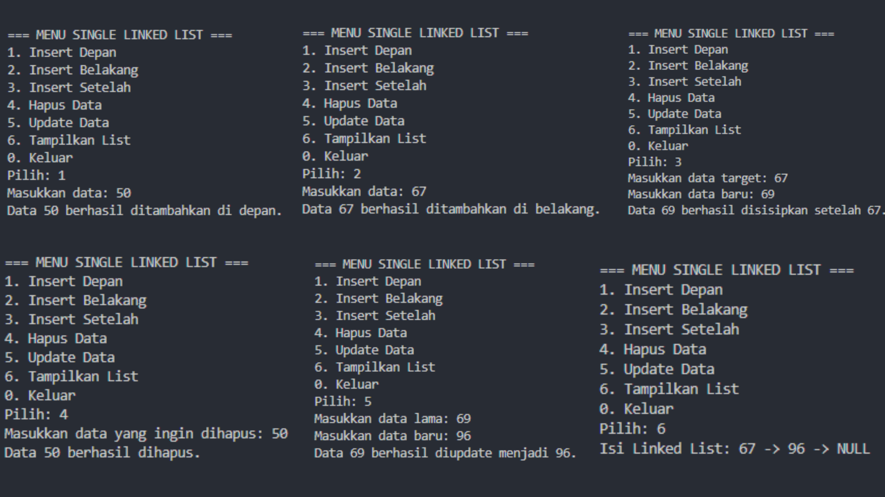
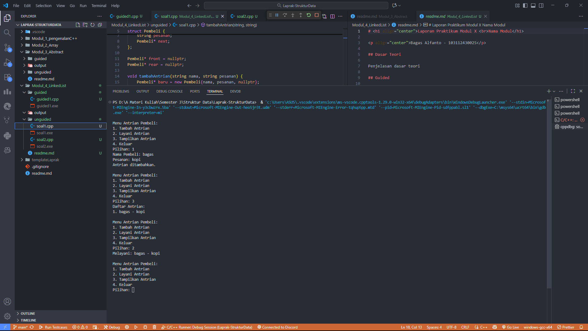
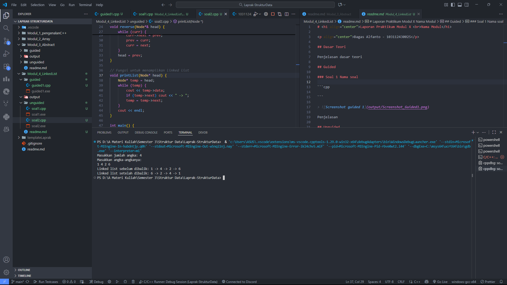

# <h1 align="center">Laporan Praktikum Modul 4 <br>LinkedList</h1>

<p align="center">Bagas Alfanto - 103112430025</p>

## Dasar Teori

Singly Linked List adalah struktur data di mana tiap node punya satu pointer ke node berikutnya, sehingga data disimpan secara dinamis di memori (bukan dalam array berurutan). Terdapat head sebagai titik awal dan tail yang biasanya menunjuk ke null. Kelebihannya fleksibel untuk penambahan/hapus tanpa menggeser elemen; kelemahannya akses acak lambat karena harus menelusuri dari head. Saat membuat struct node dan fungsi insert/delete/traverse, kamu sedang mengimplementasikan ADT Linked List: operasi ditentukan, sedangkan detail pointer dan alokasi adalah bagian implementasinya.

## Guided

### Soal 1 Linklist

```cpp
#include <iostream>
using namespace std;

// Struktur Node
struct Node {
    int data;
    Node* next;
};

// Pointer awal
Node* head = nullptr;

// Fungsi untuk membuat node baru
Node* createNode(int data) {
    Node* newNode = new Node();
    newNode->data = data;
    newNode->next = nullptr;
    return newNode;
}

// ========== INSERT DEPAN ==========
void insertDepan(int data) {
    Node* newNode = createNode(data);
    newNode->next = head;
    head = newNode;
    cout << "Data " << data << " berhasil ditambahkan di depan.\n";
}

// ========== INSERT BELAKANG ==========
void insertBelakang(int data) {
    Node* newNode = createNode(data);
    if (head == nullptr) {
        head = newNode;
    } else {
        Node* temp = head;
        while (temp->next != nullptr) {
            temp = temp->next;
        }
        temp->next = newNode;
    }
    cout << "Data " << data << " berhasil ditambahkan di belakang.\n";
}

// ========== INSERT SETELAH ==========
void insertSetelah(int target, int dataBaru) {
    Node* temp = head;
    while (temp != nullptr && temp->data != target) {
        temp = temp->next;
    }

    if (temp == nullptr) {
        cout << "Data " << target << " tidak ditemukan!\n";
    } else {
        Node* newNode = createNode(dataBaru);
        newNode->next = temp->next;
        temp->next = newNode;
        cout << "Data " << dataBaru << " berhasil disisipkan setelah " << target << ".\n";
    }
}

// ========== DELETE FUNCTION ==========
void hapusNode(int data) {
    if (head == nullptr) {
        cout << "List kosong!\n";
        return;
    }

    Node* temp = head;
    Node* prev = nullptr;

    // Jika data di node pertama
    if (temp != nullptr && temp->data == data) {
        head = temp->next;
        delete temp;
        cout << "Data " << data << " berhasil dihapus.\n";
        return;
    }

    // Cari node yang akan dihapus
    while (temp != nullptr && temp->data != data) {
        prev = temp;
        temp = temp->next;
    }

    // Jika data tidak ditemukan
    if (temp == nullptr) {
        cout << "Data " << data << " tidak ditemukan!\n";
        return;
    }

    prev->next = temp->next;
    delete temp;
    cout << "Data " << data << " berhasil dihapus.\n";
}

// ========== UPDATE FUNCTION ==========
void updateNode(int dataLama, int dataBaru) {
    Node* temp = head;
    while (temp != nullptr && temp->data != dataLama) {
        temp = temp->next;
    }

    if (temp == nullptr) {
        cout << "Data " << dataLama << " tidak ditemukan!\n";
    } else {
        temp->data = dataBaru;
        cout << "Data " << dataLama << " berhasil diupdate menjadi " << dataBaru << ".\n";
    }
}

// ========== DISPLAY FUNCTION ==========
void tampilkanList() {
    if (head == nullptr) {
        cout << "List kosong!\n";
        return;
    }

    Node* temp = head;
    cout << "Isi Linked List: ";
    while (temp != nullptr) {
        cout << temp->data << " -> ";
        temp = temp->next;
    }
    cout << "NULL\n";
}

// ========== MAIN PROGRAM ==========
int main() {
    int pilihan, data, target, dataBaru;

    do {
        cout << "\n=== MENU SINGLE LINKED LIST ===\n";
        cout << "1. Insert Depan\n";
        cout << "2. Insert Belakang\n";
        cout << "3. Insert Setelah\n";
        cout << "4. Hapus Data\n";
        cout << "5. Update Data\n";
        cout << "6. Tampilkan List\n";
        cout << "0. Keluar\n";
        cout << "Pilih: ";
        cin >> pilihan;

        switch (pilihan) {
            case 1:
                cout << "Masukkan data: ";
                cin >> data;
                insertDepan(data);
                break;
            case 2:
                cout << "Masukkan data: ";
                cin >> data;
                insertBelakang(data);
                break;
            case 3:
                cout << "Masukkan data target: ";
                cin >> target;
                cout << "Masukkan data baru: ";
                cin >> dataBaru;
                insertSetelah(target, dataBaru);
                break;
            case 4:
                cout << "Masukkan data yang ingin dihapus: ";
                cin >> data;
                hapusNode(data);
                break;
            case 5:
                cout << "Masukkan data lama: ";
                cin >> data;
                cout << "Masukkan data baru: ";
                cin >> dataBaru;
                updateNode(data, dataBaru);
                break;
            case 6:
                tampilkanList();
                break;
            case 0:
                cout << "Program selesai.\n";
                break;
            default:
                cout << "Pilihan tidak valid!\n";
        }
    } while (pilihan != 0);

    return 0;
}
```

> 

Program ini adalah implementasi dari Single Linked List menggunakan bahasa C++. Di dalam program ini, kita bisa melakukan beberapa operasi dasar seperti menambah data di depan, di belakang, atau setelah data tertentu. Selain itu, ada juga fitur untuk menghapus data, mengubah isi data (update), dan menampilkan seluruh isi list.

Struktur datanya menggunakan struct Node yang punya dua bagian, yaitu data buat nyimpan nilai, dan next buat nyambung ke node berikutnya. Program ini juga punya pointer head sebagai penanda awal list.

Di bagian menu utama, pengguna bisa memilih operasi yang mau dijalankan lewat input angka. Misalnya, pilih 1 buat nambah data di depan, 2 buat nambah di belakang, 3 buat nyisipin setelah data tertentu, 4 buat hapus data, 5 buat update data, dan 6 buat lihat isi list. Program bakal terus jalan sampai pengguna memilih opsi 0 untuk keluar.

Secara keseluruhan, program ini berguna buat memahami cara kerja struktur data Linked List secara manual mulai dari proses penyimpanan, penghapusan, sampai penelusuran data di dalam list.

## Unguided

### Soal 1

Buatlah single linked list untuk Antrian yang menyimpan data pembeli( nama dan pesanan). program memiliki beberapa menu seperti tambah antrian, layani antrian(hapus), dan tampilkan antrian. \*antrian pertama harus yang pertama dilayani

```cpp
#include <iostream>
#include <string>
using namespace std;

struct Pembeli {
    string nama;
    string pesanan;
    Pembeli* next;
};

Pembeli* front = nullptr;
Pembeli* rear = nullptr;

void tambahAntrian(string nama, string pesanan) {
    Pembeli* baru = new Pembeli{nama, pesanan, nullptr};
    if (!front) {
        front = rear = baru;
    } else {
        rear->next = baru;
        rear = baru;
    }
    cout << "Antrian ditambahkan.\n";
}

void layaniAntrian() {
    if (!front) {
        cout << "Antrian kosong.\n";
        return;
    }
    Pembeli* hapus = front;
    cout << "Melayani: " << hapus->nama << " - " << hapus->pesanan << endl;
    front = front->next;
    delete hapus;
    if (!front) rear = nullptr;
}

void tampilkanAntrian() {
    if (!front) {
        cout << "Antrian kosong.\n";
        return;
    }
    Pembeli* temp = front;
    int no = 1;
    cout << "Daftar Antrian:\n";
    while (temp) {
        cout << no++ << ". " << temp->nama << " - " << temp->pesanan << endl;
        temp = temp->next;
    }
}

int main() {
    int pilihan;
    string nama, pesanan;
    do {
        cout << "\nMenu Antrian Pembeli:\n";
        cout << "1. Tambah Antrian\n";
        cout << "2. Layani Antrian\n";
        cout << "3. Tampilkan Antrian\n";
        cout << "4. Keluar\n";
        cout << "Pilihan: ";
        cin >> pilihan;
        cin.ignore();
        switch (pilihan) {
            case 1:
                cout << "Nama Pembeli: ";
                getline(cin, nama);
                cout << "Pesanan: ";
                getline(cin, pesanan);
                tambahAntrian(nama, pesanan);
                break;
            case 2:
                layaniAntrian();
                break;
            case 3:
                tampilkanAntrian();
                break;
            case 4:
                cout << "Keluar...\n";
                break;
            default:
                cout << "Pilihan tidak valid.\n";
        }
    } while (pilihan != 4);

    // Bersihkan sisa antrian
    while (front) layaniAntrian();
    return 0;
}
```

> Output
> 

Program ini merupakan implementasi dari single linked list yang digunakan untuk membuat sistem antrian pembeli. Setiap node menyimpan data berupa nama pembeli dan pesanan yang mereka buat. Program ini memiliki tiga fitur utama, yaitu menambah antrian baru, melayani antrian (menghapus dari depan), dan menampilkan seluruh antrian yang sedang menunggu. Data disusun secara berurutan, di mana pembeli pertama yang masuk akan menjadi pembeli pertama yang dilayani (prinsip FIFO – First In First Out).

Fungsi tambahAntrian() digunakan untuk menambahkan data pembeli ke bagian belakang antrian. Fungsi layaniAntrian() berfungsi menghapus node paling depan sekaligus menampilkan nama dan pesanan pembeli yang sedang dilayani. Sedangkan fungsi tampilkanAntrian() digunakan untuk menampilkan daftar seluruh pembeli yang masih dalam antrian. Program ini berjalan menggunakan menu interaktif sehingga pengguna bisa memilih aksi yang diinginkan. Setelah program selesai, semua data antrian akan dihapus untuk mencegah kebocoran memori.

### Soal 2

buatlah program kode untuk membalik (reverse) singly linked list (1-2-3 menjadi 3-2-1)

```cpp
#include <iostream>
using namespace std;

struct Node {
    int data;
    Node* next;
    Node(int val) : data(val), next(nullptr) {}
};

// Fungsi untuk menambahkan node di akhir linked list
void append(Node*& head, int val) {
    Node* newNode = new Node(val);
    if (!head) {
        head = newNode;
        return;
    }
    Node* temp = head;
    while (temp->next)
        temp = temp->next;
    temp->next = newNode;
}

// Fungsi untuk membalik linked list
void reverse(Node*& head) {
    Node* prev = nullptr;
    Node* curr = head;
    while (curr) {
        Node* next = curr->next;
        curr->next = prev;
        prev = curr;
        curr = next;
    }
    head = prev;
}

// Fungsi untuk menampilkan linked list
void printList(Node* head) {
    Node* temp = head;
    while (temp) {
        cout << temp->data;
        if (temp->next) cout << " -> ";
        temp = temp->next;
    }
    cout << endl;
}

int main() {
    Node* head = nullptr;
    int n, val;
    cout << "Masukkan jumlah angka: ";
    cin >> n;
    cout << "Masukkan angka-angkanya:\n";
    for (int i = 0; i < n; ++i) {
        cin >> val;
        append(head, val);
    }
    cout << "Linked list sebelum dibalik: ";
    printList(head);

    reverse(head);

    cout << "Linked list setelah dibalik: ";
    printList(head);

    // Bersihkan memori
    while (head) {
        Node* temp = head;
        head = head->next;
        delete temp;
    }
    return 0;
}
```

> Output
> 

Program ini merupakan implementasi dari single linked list menggunakan bahasa C++. Program ini berfungsi untuk menyimpan sekumpulan data yang dimasukkan oleh pengguna, lalu menampilkan hasilnya sebelum dan sesudah dibalik. Data dimasukkan ke dalam list menggunakan fungsi append(), yang menambahkan node baru di bagian akhir. Setiap node berisi nilai data dan pointer ke node berikutnya. Setelah semua data dimasukkan, program menampilkan isi linked list sesuai urutan input.

Selanjutnya, program menggunakan fungsi reverse() untuk membalik urutan elemen di dalam linked list, sehingga elemen terakhir menjadi yang pertama. Hasil dari proses pembalikan ini kemudian ditampilkan kembali ke layar. Di bagian akhir, program juga melakukan pembersihan memori dengan menghapus seluruh node satu per satu agar tidak terjadi kebocoran memori. Program ini membantu memahami cara kerja dasar linked list seperti penambahan, penelusuran, pembalikan data, dan pengelolaan memori dinamis.

## Referensi

[1] Modul 6 Single & Double Linked List, Universitas Negeri Malang. Modul Struktur Data (PDF) https://elektro.um.ac.id/wp-content/uploads/2016/04/ASD-Modul-6-Linked-List.pdf

[2] Linked List, Modul Kuliah Struktur Data Universitas Esa Unggul. https://lms-paralel.esaunggul.ac.id/pluginfile.php?file=%2F86227%2Fmod_resource%2Fcontent%2F1%2FModul+Struktur+Data-Linked+List.pdf

[3] “Struktur Data: Pengertian dan Implementasi Dasar Linked List”, Rumah Coding. https://rumahcoding.co.id/linked-list-pengertian-dan-implementasi-dasar/
